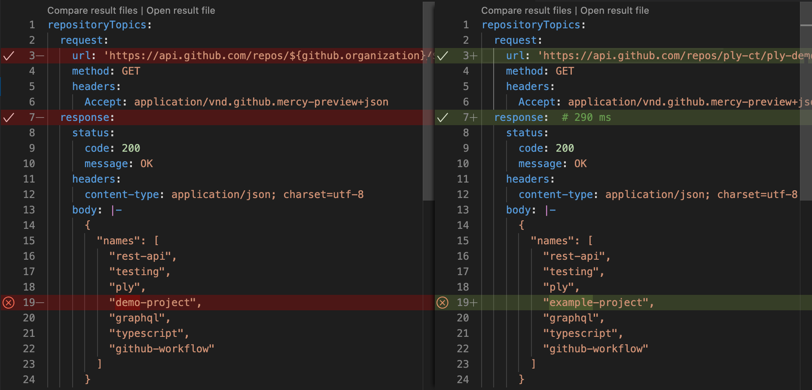
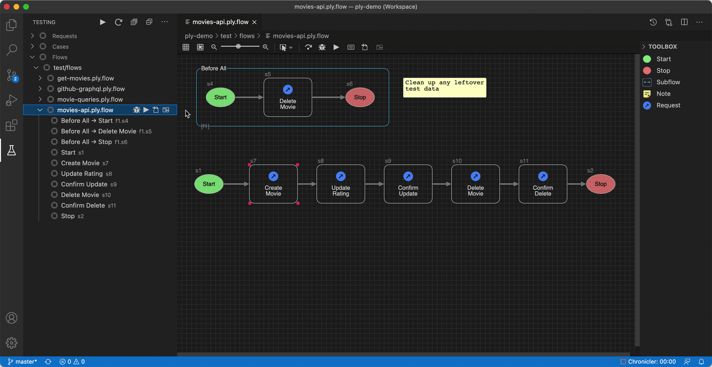

<a href="https://ply-ct.github.io/ply/topics/requests">
  
</a>

**API Automated Testing**  
<a href="https://ply-ct.github.io/ply/topics/requests">
  
</a>

 

[Ply](https://ply-ct.com/) is simply a more intuitive way of autotesting your REST and GraphQL APIs. Start with a YAML file
describing your [requests](https://ply-ct.github.io/ply/topics/requests). Run Ply to submit these requests 
and compare actual results against expected, with [template literal](https://developer.mozilla.org/en-US/docs/Web/JavaScript/Reference/Template_literals) 
placeholders for dynamic values. The Ply extension gives you a side-by-side diff view so you can compare
results at a glance.



Checkmarks indicate diff lines that're okay, such as substituted values or comments; whereas Xs indicate
significant differences causing test failure(s).

When you need greater control, Ply [cases](https://ply-ct.github.io/ply/topics/cases) give you
programmatic access via TypeScript to supplement this built-in expected/actual verification.

## Features
  - Test Explorer sidebar shows all Ply requests/cases/suites along with their statuses
  - CodeLens segments in your Ply test files for running tests and debugging cases
  - Gutter decorations on your Ply test files showing test statuses
  - Test log displayed in Output view when a test is selected in Test Explorer
  - Diff editor for comparing expected/actual results, with smart decorations aware of runtime values
  - Import Ply requests from [Postman](https://www.postman.com/) collections



## Dependencies
Requires [Test Explorer UI](https://marketplace.visualstudio.com/items?itemName=hbenl.vscode-test-explorer) extension.

## Configuration
Honors [plyconfig.json/yaml](https://ply-ct.github.io/ply/topics/config). Values there are superseded by the following vscode settings:
Setting | Description | Default
------- | ----------- | -------
`ply.testsLocation` | Base directory (absolute or relative to workspace root) for all Ply request and case files | .
`ply.requestFiles` | Glob pattern for Ply request files | **/*.{ply.yaml,ply.yml}
`ply.caseFiles` | Glob pattern for Ply case files | **/*.ply.ts
`ply.ignore` | Glob pattern for places to ignore | \**/{node_modules,bin,dist,out}/**
`ply.skip` | Glob pattern for tests to skip |
`ply.expectedLocation` | Expected results base dir | testsLocation + '/results/expected'
`ply.actualLocation` | Actual results base dir | testsLocation + '/results/actual'
`ply.logLocation` | Log file base dir | actualLocation
`ply.logpanel` | Write detailed log output to the Ply Invoker output panel | false
`ply.valuesFiles` | JSON files containing Ply values | 
`ply.debugPort` | Port to use for debug connections | 9229
`ply.debugConfig` | Name of a launch configuration to use for debugging | (see below)
`ply.nodePath` | Path to node executable | Find on your PATH; if not found, use node shipped with VS Code
`ply.plyPath` | Path to ply package (relative to workspace folder) eg: "node_modules/ply-ct" | Use a bundled version of ply

### Custom debug configuration
You can specify a custom vscode debug configuration to use for Ply cases instead of the built-in default.
Do this by creating a debugging configuration in `.vscode/launch.json`. Then specify the name of that
in setting `ply.debugConfig`. The default built-in debug configuration looks like this:
```
{
  "name": "Ply Debugging",
  "type": "node",
  "request": "attach",
  "port": 9229,
  "protocol": "inspector",
  "timeout": 10000,
  "continueOnAttach": true
}
```

## Troubleshooting
If your Ply tests are not displayed or not executing correctly, you can diagnose problems by turning
on logging to "Ply Invoker" in Output view through this VS Code setting:
 - `ply.logpanel`
